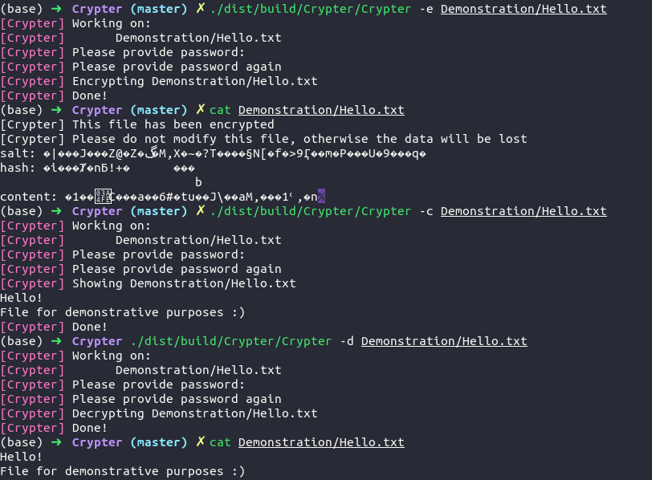

# Crypter
## Encrypting your confidential files
### Usage
```
Usage: ./Crypter flags files
Flags: 
    -e -> encrypt file
    -c -> show contents of encrypted file
    -d -> decrypt encrypted file
    -r -> work recursively on directories
    -h -> guide
```
### Details
Encrypting files using AES256 together with a key derivation function PBKDF2
### Example usage

### Warnings
